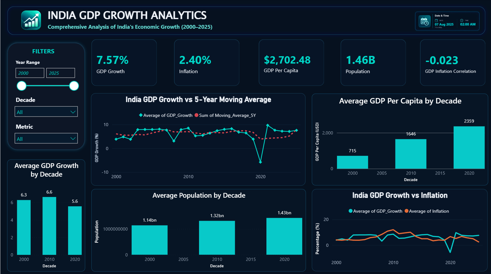

# 🇮🇳 India GDP Growth Analytics | 2000–2025

A data-driven analysis of India's economic growth from 2000–2025, combining Python, SQL, and Power BI to transform economic data into meaningful insights and interactive visualizations.

## 📌 Project Overview
This project analyzes India's economic growth over the period 2000–2025 using an end-to-end data analytics workflow. The analysis focuses on GDP growth, inflation, population, population growth, GDP per capita, GDP per capita growth, decade-wise performance, moving averages, growth volatility, and the COVID-19 period.

**The project combines:**
* **🐍 Python:** For data preparation, exploratory analysis, calculations, and visualization.
* **🗄️ SQL:** For analytical queries, ranking, trend analysis, categorization, and moving averages.
* **📊 Power BI:** For interactive dashboard development and business-style reporting.
* **📈 Matplotlib & Seaborn:** For analytical visualizations.
* **📋 Excel/XLS:** As the initial GDP data source.

---

## 🎯 Objectives
* Analyze India's annual GDP growth from 2000 to 2025.
* Identify the highest and lowest GDP growth years.
* Compare GDP performance across decades.
* Calculate and analyze a 5-year moving average.
* Examine the relationship between GDP growth and inflation.
* Analyze population and population growth trends.
* Track GDP per capita and its growth.
* Study the 2019–2021 COVID-period economic performance.
* Identify GDP growth distribution and potential outliers.
* Present findings through an interactive Power BI dashboard.

---

## 🛠️ Tools & Technologies
| Tool / Technology | Purpose |
|---|---|
| **Python (Pandas, NumPy)** | Data analysis, manipulation, transformation, and calculations |
| **Matplotlib & Seaborn** | Data and statistical visualization |
| **SQL** | Querying and analytical analysis |
| **Power BI** | Interactive dashboard and reporting |
| **Jupyter Notebook** | Reproducible Python workflow |

---

## 🔄 End-to-End Workflow
> **Raw Economic Data** → **Data Extraction & Preparation** → **India Selection (IND)** → **2000–2025 Filtering** → **Python Data Analysis** → **Indicator Integration** → **SQL Analysis** → **Visualizations** → **Power BI Dashboard** → **Insights**

---

## 📊 Key Analysis Areas & Findings

### Core Analysis Areas
1. **GDP Growth Analysis:** Analyzes annual GDP growth (26 yearly observations).
2. **Moving Averages & Decades:** Calculates a 5-year rolling average to smooth short-term fluctuations and groups performance by decade.
3. **Macroeconomic Indicators:** Integrates inflation, total population, and GDP per capita to examine correlations.
4. **COVID-19 Impact (2019–2021):** Specifically examines the sharp GDP contraction in 2020 and the subsequent recovery.
5. **Outliers:** Uses descriptive statistics and box plots to identify growth distribution anomalies.

### 📈 Key Findings
* **Highest GDP growth:** 2021 (9.69%)
* **Lowest GDP growth:** 2020 (-5.78%)
* **2025 Projections:** GDP growth at 7.57%, Inflation at 2.40%, GDP per capita at ~$2,702.48, Population at ~1.46 billion.
* **Historical Average:** The average annual GDP growth across 2000–2025 is approximately **6.25%**.
* **Observation:** The dataset highlights a significant disruption in 2020 followed by a massive, strong rebound in 2021.

---

## 💻 Technical Implementation

### 📊 Power BI Dashboard Overview
Provides a consolidated view of economic performance, including KPIs (GDP Growth, Inflation, GDP Per Capita, Population), Growth vs 5-Year Moving Average, and Decade-wise trends.



### 📉 Python Analysis & Graph Overview
The Jupyter Notebook performs the main EDA, API retrievals, and calculations. Below is a snapshot of the India GDP Growth vs. 5-Year Moving Average trend over the years.


*(For more analytical graphs like Inflation correlations and Outliers, check the `visualizations/` folder)*

### 🗄️ SQL Analysis
The SQL script (`sql/India_GDP_Analysis_SQL.sql`) utilizes advanced functions including Aggregations, `CASE` statements, `LAG()`, `RANK()`, and Window functions to compute year-over-year changes, decade averages, and growth categorizations.

---

## 📁 Repository Structure
```text
India-GDP-Growth-Analytics/
├── data/
│   ├── GDP_DataSet.xls
│   ├── GDP_Missing_2000_2003.csv
│   └── India_Economic_Analysis_2000_2025.csv
├── analysis/
│   ├── India_GDP_Growth_Analysis.ipynb
│   ├── India_GDP_Analysis_SQL.sql
│   └── India_GDP_Analysis_Dashboard.pbix
├── dashboard/
│   ├── India_GDP_Analysis_Dashboard.pbix
│   └── India_GDP_PowerBI_Dashboard.png
├── visualizations/
│   ├── India GDP Growth Rate (2000–2025).png
│   ├── India GDP Growth vs 5-Year Moving Average.png
│   ├── India GDP Growth vs Inflation (2000–2025).png
│   ├── India GDP Growth Distribution and Outliers.png
│   ├── India GDP Growth_Pre-COVID to Recovery.png
│   └── Average India GDP Growth by Decade.png
└── README.md
---

## 🎓 Skills Demonstrated
* **Analytics:** EDA, Data Cleaning, Descriptive Statistics, Trend/Correlation/Outlier/Time-series Analysis.
* **Python:** Pandas, NumPy, API data retrieval, Data merging, Matplotlib, Seaborn.
* **SQL:** Window functions, moving averages, CTEs, Categorization.
* **BI:** KPI reporting, Dashboard design, Interactive presentations.

---

## 👤 Author
**Aryan Gupta**  
*Business Analyst | Data Analyst | Power BI | SQL | Advanced Excel | Business Intelligence*

* **GitHub:** [@aryan1821](https://github.com/aryan1821)
* **LinkedIn:** [Aryan Gupta](https://www.linkedin.com/in/aryangupta-data)

---

⭐ **If you find this project useful, feel free to explore the code and dashboard. Don't forget to star the repository!**
